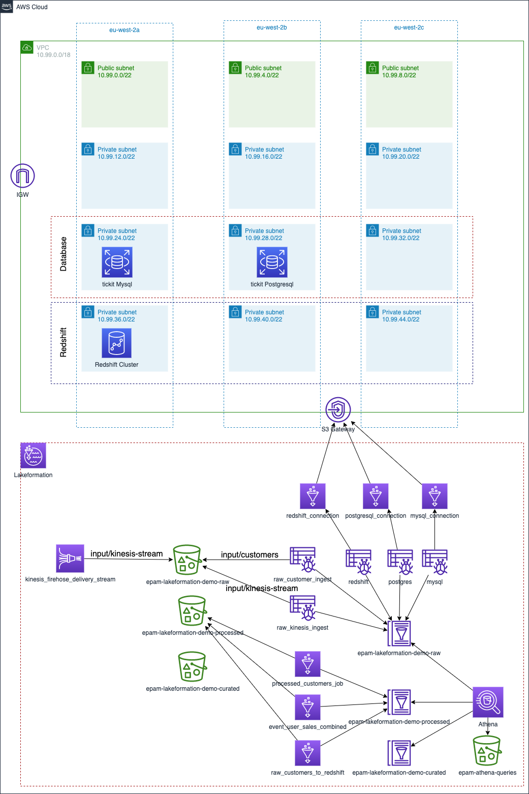

# aws-lakeformation-demo

## lakeformation landscape

## mysql DB

## postgresql DB

## lakeformation mysql blueprint

## lakeformation postgresql blueprint

#### [1] execute to prepare the env

> export AWS_DEFAULT_REGION=eu-west-2 \
  export AWS_DEFAULT_PROFILE=development

#### [2] execute the infrastructure

> terraform init \
> terraform apply -auto-approve \
> terraform show -json

#### [3] execute the infrastructure

##### [3.1] Create Customer S3 Catalog by runining